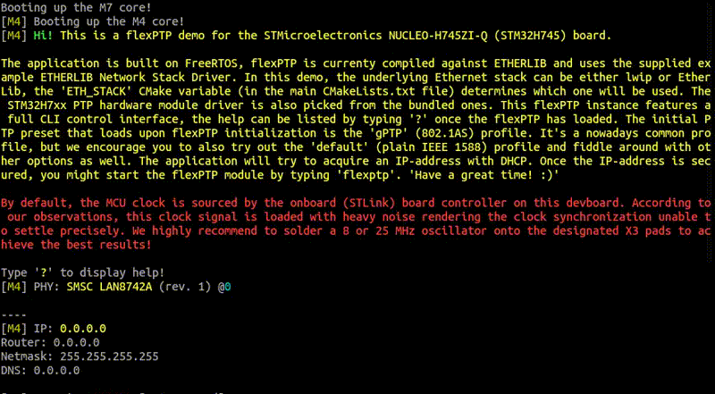

# STM32 NUCLEO-H745ZI-Q flexPTP demo

<!-- 
 -->



## What's this?

> **This is a [flexPTP](https://github.com/epagris/flexPTP) demo project showcasing the capabilities of the flexPTP [IEEE 1588 Precision Time Protocol](https://ieeexplore.ieee.org/document/9120376) implementation for the [STMicroelectronics NUCLEO-H745ZI-Q](https://www.st.com/en/evaluation-tools/nucleo-h745zi-q.html) dual-core MCU devboard.**

Still not clear what is it useful for? No worries, it's a behind-the-scenes support technology that you use unaware every day if you have a smartphone or when you are connected to the internet. Modern telecommunication and measurement systems often rely on precise time synchronization down to the nanoseconds' scale. Methods got standardized by the IEEE and now it's known by the name of the Precision Time Protocol. This software project is an evaluation environment to showcase the capabilities of our IEEE 1588 PTP implementation named `flexPTP` on the STMicroelectronics NUCLEO-H745ZI board.

> [!TIP]
>**Just want to try the demo and skip compiling? Download one of the precompiled binaries and jump to [Deploying](#deploying)!**

> [!TIP]
> **Have not seen any dual-core MCU project before? Don't panic, go on with reading this and you will have a picture of it for sure! :)**

### Get the sources

> [!NOTE]
> To acquire the full source tree after cloning the repo, please fetch the linked *submodules* as well:

```
git clone https://github.com/epagris/flexPTP-demo-NUCLEO-H745ZI-Q
cd flexPTP-demo-NUCLEO-H745ZI-Q
git submodule init
git submodule update
```

## Building

> [!NOTE]
> **The [STM32H745](https://www.st.com/en/microcontrollers-microprocessors/stm32h745-755.html) is a multicore device with a Cortex-M7 and a Cortex-M4 core. The software is built separately for the M7 and the M4 cores!**

### Prerequisites

The following two pieces of software are necessary for building:
- `arm-none-eabi-gcc` (v12+): the GCC ARM Cortex-M C cross-compiler
- `cmake` (v3.22+): KitWare's build management system

> [!NOTE]
> Both applications are available on common Linux systems through the official package repository. For building on Windows we recommend to install the [STM32CubeCLT](https://www.st.com/en/development-tools/stm32cubeclt.html) bundle shipping the `arm-none-eabi-{gcc|gdb}`, `openocd` and ST's proprietary STLink downloading tools. The [CMake](https://cmake.org/) needs to be installed separately.

### Compiling

The project is fully CMake managed. Configure and invoke the cross-compiler using the commands below and **compile targets for both cores**:

```
cmake . -B build
cmake --build build --target CM4 CM7 --
```
Once the building has concluded the output binaries would be deposited per core in the `build/CM4` and `build/CM7` directories: `CM4.elf`, `CM7.elf`. **Intentionally NO `.bin` dumps are generated. If they were they would span the whole MCU Flash address range (including gaps as well) resulting in unmanagable ~640MB files.** The `.elf` files carry addressing information as well, they are much more effective in size.

## Deploying

### Downloading the firmware

The compiled pair of `.elf` binaries can be downloaded onto the devboard through several tools, see below. The two binaries have no overlapping memory ranges so that uploading them one after the other is viable.

### Using the STM32CubeProgrammer

The [STM32CubeProgrammer](https://www.st.com/en/development-tools/stm32cubeprog.html) recognizes the MCU once connected. Upload the `CM4.elf` and `CM7.elf` separately on the *Erasing & Programming* pane.

### Using the `openocd` application

The [OpenOCD](https://openocd.org/) programming/debugging tool can also be used to upload the firmware using the following command:

`openocd -f "board/st_nucleo_h745zi.cfg" -c init -c halt -c "program build/CM4/CM4.elf" -c "program build/CM7/CM7.elf" -c exit`

OpenOCD is also available through the common Linux package managers.

### Interacting with the firmware

The firmware prints its messages to and expect user input coming on the board controller's virtual serial port using the `115200-8-N-1` configuration. Use [Putty](https://www.putty.org/) or any equivalent (e.g. GtkTerm) serial port terminal to communicate with the firmware. On Linux, the device will show up as `/dev/ttyACMx`.

> [!NOTE]
> Read the firmware's bootup hints and messages carefully!

### PPS signal

The 1PPS signal is emitted on the `PB5` pin.

## Test environment

To test the software and evaluate the synchronization accuracy connect the devboard with another PTP-compatible equipment, either a dedicated Master clock or any other device (e.g. another devboard). We recommend using the [linuxptp](https://github.com/richardcochran/linuxptp) software suite available in Linux systems through the official package repositories, PTP hardware support is available out-of-the-box on several Intel NICs, like Intel I210, Intel I219-V or Intel 82576.

## Development

An all-around [Visual Studio Code](https://code.visualstudio.com/) project is packaged along the project to enable easy development, debugging and editing. To enable these powerful features, install the [STM32Cube for Visual Studio Code](https://marketplace.visualstudio.com/items?itemName=stmicroelectronics.stm32-vscode-extension), [CMakeTools](https://marketplace.visualstudio.com/items?itemName=ms-vscode.cmake-tools), [Cortex-Debug](https://marketplace.visualstudio.com/items?itemName=marus25.cortex-debug), [Embedded Tools](https://marketplace.visualstudio.com/items?itemName=ms-vscode.vscode-embedded-tools) extensions, [OpenOCD](https://openocd.org/) and the [STM32CubeCLT](https://www.st.com/en/development-tools/stm32cubeclt.html) software package. The latter one is required for downloading the firmware right away using the Cortex-Debug extension (if not done through OpenOCD) and for providing the Embedded Tools extension with register description `.SVD` files. [clangd](https://marketplace.visualstudio.com/items?itemName=llvm-vs-code-extensions.vscode-clangd) and clang-format are highly recommended.

This project has predefined *Launch* and *Attach* tasks. Uploading the firmware and attaching to this dual-core MCU is a bit tricky: first program both cores, then connect to and start the M7 core, and then attach to the M4 core. It's also possible to debug or reprogram just one core. 

### Software structure

The project is relying on the following large software building blocks:
- the [FreeRTOS](https://www.freertos.org/) embedded operating system modified for this particular project,
- the [CMSIS RTOS V2](https://arm-software.github.io/CMSIS_6/latest/RTOS2/index.html) module as a wrapper for FreeRTOS,
- [STM32H7xx Hardware Abstraction Layer library](https://github.com/STMicroelectronics/stm32h7xx-hal-driver) (HAL) providing MCU specific functionality,
- the [Lightweight IP](https://github.com/lwip-tcpip/lwip) (lwip) Ethernet stack extended with PTP timestamp support,
- the [EtherLib](https://gitea.epagris.com/epagris/EtherLib), our in-house developed Ethernet stack,
- the [embfmt](https://gitea.epagris.com/epagris/embfmt) a printf()-like formatted printer implementation for embedded systems.

> [!TIP]
> The project can either use LwIP or EtherLib Ethernet stacks. This can be easily changed by setting the `ETH_STACK` CMake variable in the `CM4/CMakeLists.txt`:
> ```
>set(ETH_STACK "LWIP") # select "LWIP" or "ETHERLIB"
>```
> The development of the EtherLib network stack was motivated in the beginning by just curiosity and our need for something that is suitable for our university research. Gradually it became a handy tool so we've decided to promote it into our public projects as well.
>

The Ethernet and PTP-related functionality is managed by the M4 core, the M7 core handles the system initialization and standard output UART communication.
The project is organized the following way:

```
ROOT
  Common: sources and libraries used by both cores
    Boot: boot and init functions
    Drivers
      CMSIS: ARM CMSIS-related files (CMSIS RTOS V2 and device headers)
      STM32H7_HAL/stm32h7xx-hal-driver: ST's STM32H7xx HAL driver files (submodule)
    ICC: inter-core communication methods
    Middlewares
      embfmt: a printf()-like formatted printer implementation for embedded systems (submodule)
      FreeRTOS: the custom tailored 
    shared.ld: linker script for the shared areas

  CM4: Cortex-M4 core files
    Common: symlink to the Common folder
    Drivers
      EthDrv: a custom Ethernet driver (with PTP timestamp support), a PHY-interface and network stack interfaces
    Inc: headers for compile-time library configuration
    Modules
      flexptp: our PTP implementation (submodule)
      lwip and lwip_port: the LwIP Ethernet stack and its system dependent module (submodule)
      etherlib: our in-house developed Ethernet stack (submodule)
      blocking_io: a simple blocking FIFO implementation
    Src
      cliutils: CLI-interface implementation
      ethernet: Ethernet stack initialization

      cmds.c: custom CLI commands

  CM7: Cortex-M7 core files
    Common: symlink to the Common folder
    Inc: headers for compile-time library configuration
    Modules
      blocking_io: a simple blocking FIFO implementation
    Src: main source files
```
> [!NOTE]
> The flexPTP parameters are defined in the [flexptp_options.h](Inc/flexptp_options.h) header.

#### Handling code redundancy

Libraries appearing in the `Common` folder are compiled for both cores resulting in binary symbols under the same names. Having the same library names for both cores breaks the CMake-managed compilation with a 'multiple symbol definition' error. To circumvent it common libraries are postfixed with the target core name, i.e. `freertos_kernel` -> `freertos_kernel_CM4` and `freertos_kernel_CM7`. Unfortunately, even this way the resulted `.elf`s cannot be combined, only the build gets managable. Although, the Cortex-M7 core could run the Cortex-M4 programs for sure, doing so all advanced features of the M7 core would be just sitting there idly.

### Bootup sequence

The M7 core is the first to start up, the M4 core is being held in reset for a while. The M7 core initializes clocks, standard output and the Inter-Core Communication (ICC) channel. After all these are done the M4 core is release from the reset.

### Printing and logging

In this project the memory-heavy `printf()` is replaced by the more embedded-optimized `MSG()` function backed by the `embfmt` library. Parameters and format specifiers are fully `printf()` compatible.

Each message on the standard output is prefixed with the origin of the message, either the M4 or the M7 core. The CLI interpreter is installed on the CM4 core.

### CLI commands

The software offers you with the following multitude, most flexPTP-related of commands:

```
?                                                  Print this help (22/48)
hist                                               Print command history
osinfo                                             Print OS-related information
flexptp                                            Start flexPTP daemon
ptp pps {freq}                                     Set or query PPS signal frequency [Hz]
ptp servo params [Kp Kd]                           Set or query K_p and K_d servo parameters
ptp servo log internals {on|off}                   Enable or disable logging of servo internals
ptp reset                                          Reset PTP subsystem
ptp servo offset [offset_ns]                       Set or query clock offset
ptp log {def|corr|ts|info|locked|bmca} {on|off}    Turn on or off logging
time [ns]                                          Print time
ptp master [[un]prefer] [clockid]                  Master clock settings
ptp info                                           Print PTP info
ptp domain [domain]                                Print or set PTP domain
ptp addend [addend]                                Print or set addend
ptp transport [{ipv4|802.3}]                       Set or get PTP transport layer
ptp delmech [{e2e|p2p}]                            Set or get PTP delay mechanism
ptp transpec [{def|gPTP}]                          Set or get PTP transportSpecific field (majorSdoId)
ptp profile [preset [<name>]]                      Print or set PTP profile, or list available presets
ptp tlv [preset [name]|unload]                     Print or set TLV-chain, or list available TLV presets
ptp pflags [<flags>]                               Print or set profile flags
ptp period <delreq|sync|ann> [<lp>|matched]        Print or set log. periods
ptp coarse [threshold]                             Print or set coarse correction threshold
ptp priority [<p1> <p2>]                           Print or set clock priority fields
```

> [!TIP]
> The above hint can be listed by typing '?'.

## Notes

> [!WARNING]
> By default, the MCU clock is sourced by the onboard (STLink) board controller on this devboard. According to our observations, this clock signal is loaded with heavy noise rendering the clock synchronization unable to settle precisely. We highly recommend to solder a 8 or 25 MHz oscillator onto the designated X3 pads to achieve the best results!


## Related papers and references

[Time Synchronization Extension for the IO-Link Industrial Communication Protocol](https://ieeexplore.ieee.org/document/10747727)

[Distributed Measurement System for Performance Evaluation of Embedded Clock Synchronization Solutions](https://ieeexplore.ieee.org/document/9805958/)

[Portable, PTP-based Clock Synchronization Implementation for Microcontroller-based Systems and its Performance Evaluation](https://ieeexplore.ieee.org/document/9615250)

[Synchronization of Sampling in a Distributed Audio Frequency Range Data Acquisition System Utilizing Microcontrollers](https://ieeexplore.ieee.org/document/9918455/)

[Methods of Peripheral Synchronization in Real-Time Cyber-Physical Systems](https://ieeexplore.ieee.org/document/10178979/)


## License

The project was created by András Wiesner (Epagris) in 2025 and published under the MIT license. Contributions are welcome! :)


